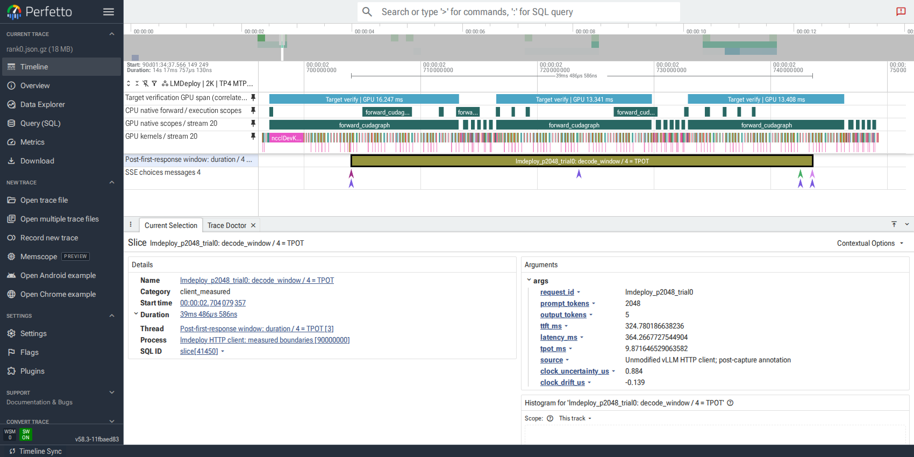
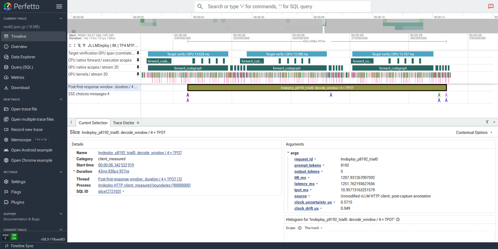
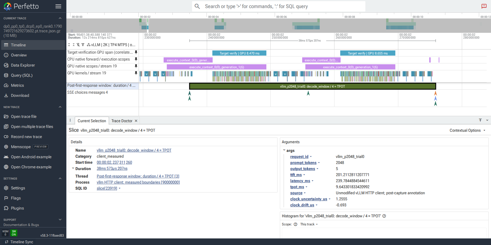
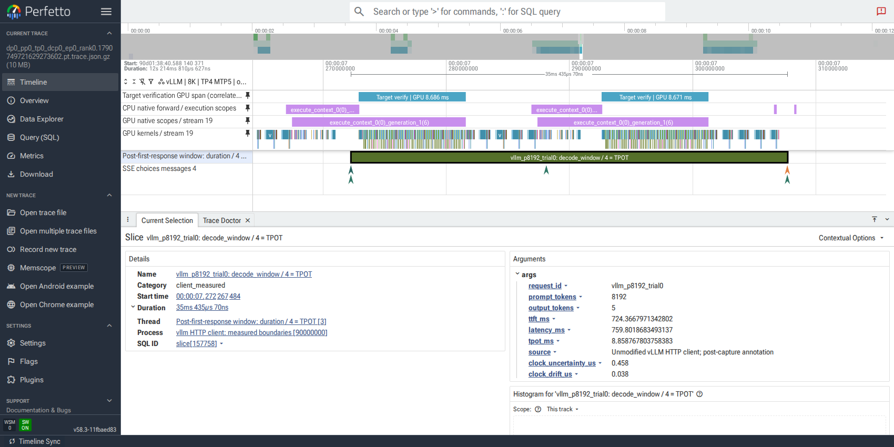

# PR #4968: CPU+CUDA Perfetto decode screenshots

Captured from https://ui.perfetto.dev/ (v58.3-11fbaed83). All four screenshots use rank 0, trial 0 from the 2026-09-30 diagnostic capture. They are actual browser screenshots, not reconstructed illustrations.

TP4/EP1/DP1, BS1, MTP5, BF16 KV, FP32 recurrent state, max batch 16, prefill chunk 2048, output 5 tokens. LMDeploy ec2ec448; vLLM 606d124b.

The selected client window uses timestamps from the unchanged vLLM streaming HTTP client, overlaid after capture. Duration / (5-1) is client TPOT. GPU graph spans are SQL-derived first-to-last correlated kernel intervals, not client latency or sums of kernel times. The native CPU/GPU scope and kernel tracks are retained. These profiled durations include capture overhead and must not replace the unprofiled performance table.

Perfetto reports overlapping Chrome complete events (`slice_spill_overlapping_complete_event`: LMDeploy 2819; vLLM 2380). The notification is retained in the screenshots. Every selected client interval and the second target graph's kernel count and GPU span was checked against the source JSON (2760 LMDeploy kernels; 1596 vLLM kernels).

Full original and client-overlay traces remain in the local report `glm5.3flash/reports/opt_plan1_20260929/profile_cpu_cuda_prefill2048_20260930`. This independent asset branch is not the PR source branch.

## lmdeploy / 2048 input tokens

## lmdeploy / 8192 input tokens

## vllm / 2048 input tokens

## vllm / 8192 input tokens

